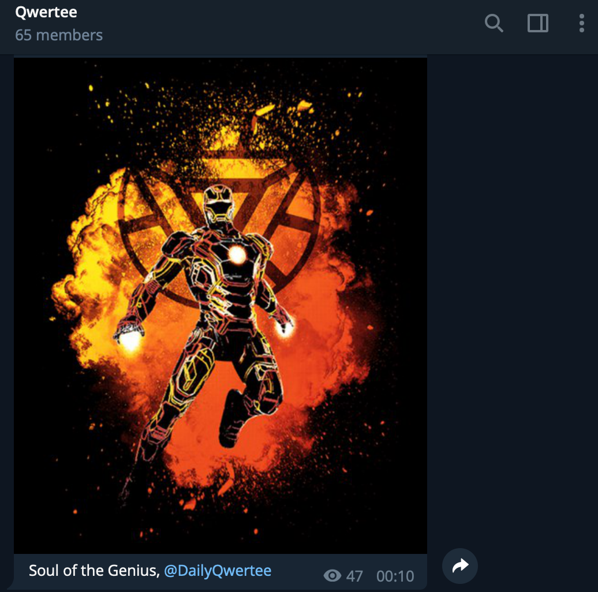

# DailyQwertee
[](https://t.me/DailyQwertee)

Sends you the 3 daily tshirts from qwertee.com, scheduled with cron to be executed at 23:10 every day.




## Development setup

This repo contains files to deploy the bot both on docker (and exporting it to any cloud provider) and on gcloud with appengine&cronjobs.

## Deployment

### Gcloud.

#### Appengine with cron scheduler
To deploy on gcloud first create a credentials.yaml file on the gcloud-app folder with the bot TOKEN:
```
env_variables:
  TELEGRAM_TOKEN: <TOKEN>
```


Then run the following commands

```bash
#inside the gcloud app folder
$ gcloud app deploy

$ gcloud app deploy cron.yaml
```

Easy as that!

#### Cloud functions with google scheduler and pub/sub
To deploy on gcloud with cloud functions use the code under `cloud_function` and follow the tutorial from google. https://cloud.google.com/scheduler/docs/tut-pub-sub

### Docker
In order to use the Docker setup, use the following commands:

```bash
#inside the project folder

$ docker build -t qwerteebot .

$ docker run -v <ABSOLUTE_PATH_TO_BOT_TOKEN>:/bot/token.txt qwerteebot
```

May change the Dockerfile to a light base image (probably alpine) in the future.

### Github actions

With the current github action under `.github/workflows` you can have the script run at an schedule time. This is the current deployment.
## TODOs
* To write the list of TODOs

## Release History
* 0.0.3
    * Github actions support
* 0.0.2
    * Cloud functions support
* 0.0.1
    * First release

## Meta

Distributed under the MIT license. See ``LICENSE`` for more information.

[https://github.com/jiwidi/DailyQwertee](https://github.com/jiwidi/)

## Contributors
[https://github.com/zhonskate](https://github.com/zhonskate)
## Contributing

1. Fork it (<https://github.com/jiwidi/DailyQwertee/fork>)
2. Create your feature branch (`git checkout -b feature/fooBar`)
3. Commit your changes (`git commit -am 'Add some fooBar'`)
4. Push to the branch (`git push origin feature/fooBar`)
5. Create a new Pull Request

